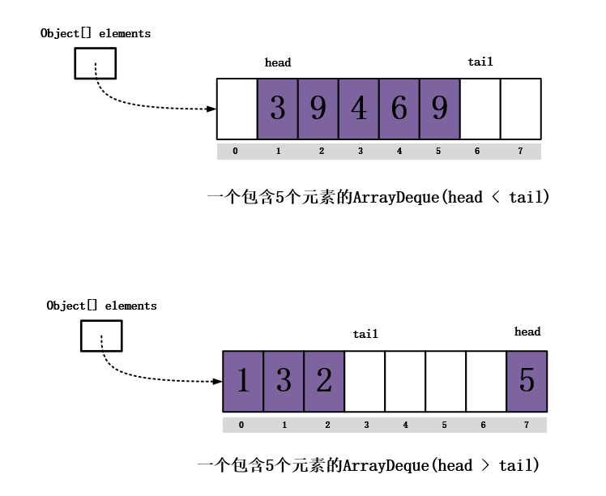

【集合框架之ArrayDeque类详解 https://blog.csdn.net/lucklycoder/article/details/115381856】

ArrayDeque是双向队列，线程不安全的双向队列，长度可以自己扩容的双向队列，并且长度需要是2的幂次方。

接口提供了从头部插入、尾部插入，从头部获取、尾部获取以及删除等操作。
ArrayDeque从名称来看能看出ArrayDeque内部使用的是数组来进行存储元素。

☞ ArrayDeque是采用数组方式实现的双端队列。
☞ ArrayDeque的出队入队是通过头尾指针循环，利用数组实现的。
☞ ArrayDeque容量不足时是会扩容的，每次扩容容量增加一倍。
☞ ArrayDeque可以直接作为栈使用。当用作栈时，性能优于Stack，当用于队列时，性能优于LinkedList。
☞ 无容量大小限制，容量按需增长。
☞ 非线程安全队列，无同步策略，不支持多线程安全访问。
☞ 具有fail-fast特性，不能存储null值，支持双向迭代器遍历。

